STM32 F407 Discovery LLライブラリを使ってボタン入力（ポーリング・割り込み）
===

STM32の開発には、STマイクロエレクトロニクス提供のライブラリを使うのが効率的とされており、現在は LL API（Low-Layer Application Programming Interface）ソフトウェアが無償提供されています。
さらに STM32CubeIDE という開発環境 (IDE) も同様に無償で使えるため、STM32CubeIDE と LL を使って開発します。

使用するハードウェアは STM32F4DISCOVERY です。
秋月電子やRSコンポーネンツで 3000円程度 で購入できます。

# 解説内容

今回解説する内容はボタン入力をする方法です。
ボタンが押されたらLEDが点灯し、離されたら消灯するようにします。
開発は２つに分けて行っていきます。
第一弾では、ボタン入力をポーリングして検出します。
第二段では、ボタン入力を割り込みで検出します。

# 用意するもの

* [STM32F4DISCOVERY](https://www.st.com/ja/evaluation-tools/stm32f4discovery.html)
* USB mini-B ケーブル

# 開発環境

* MacBook Pro (13-inch, 2019, Four Thunderbolt 3 ports)
* macOS Catalina バージョン 10.15.6
* [STM32CubeIDE](https://www.st.com/ja/development-tools/stm32cubeide.html) Version: 1.4.0


STM32CubeIDE のインストールには、STマイクロエレクトロニクスへのアカウント登録（無料）が必要です。
インストーラを実行するだけで簡単にインストールできます。

# 【第一弾】 ボタン入力をポーリングで検出する

## コーディング前の準備

STM32CubeIDE を起動すると以下の画面が開きます。
画面左の C/C++ Projects で右クリックし、 [New] → [STM32 Project] を選択します。

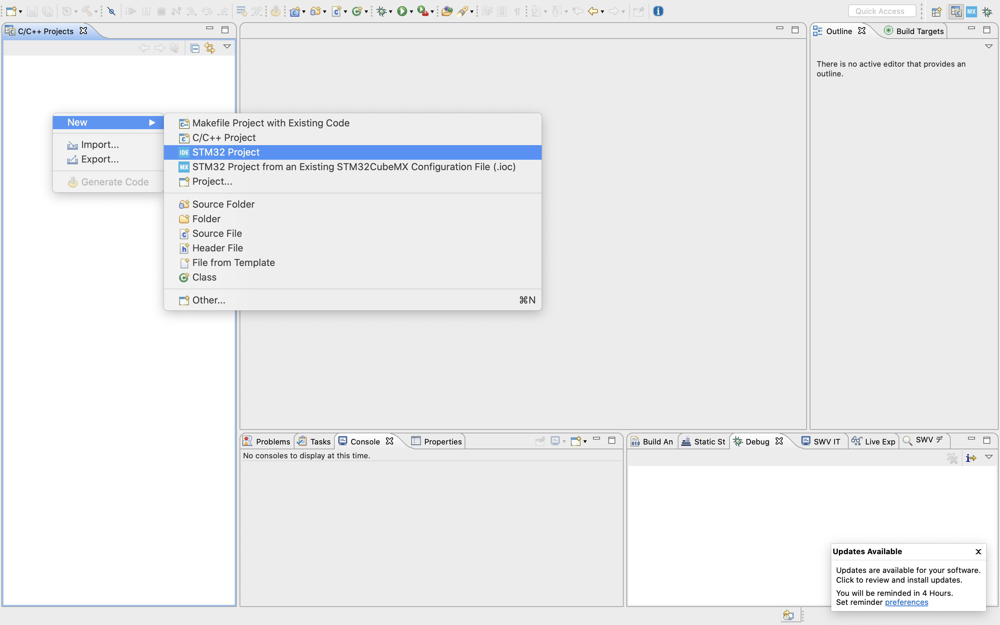

マイコンの種類を選択する画面が開きます。
上バーから Board Selector を選び、 Commercial Part Number で STM32F407G-DISC1 を選択します。
画面右にボードの写真が出てくるので選択し、右下の Next を押します。

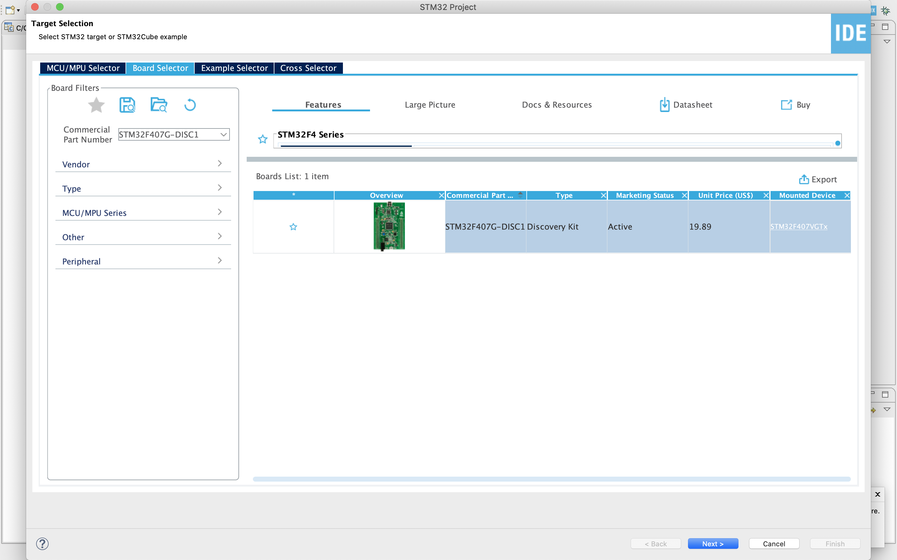 

Project Name を入力し、 Finish を押します。

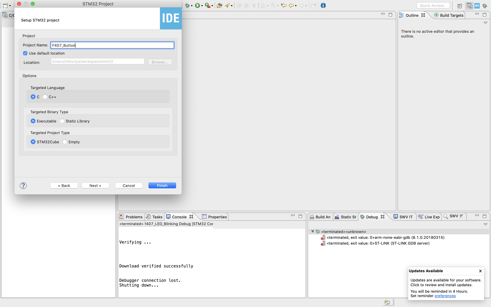

今回は No を選択します。
（Yes を選択した方が楽なこともありますが勉強のため。）

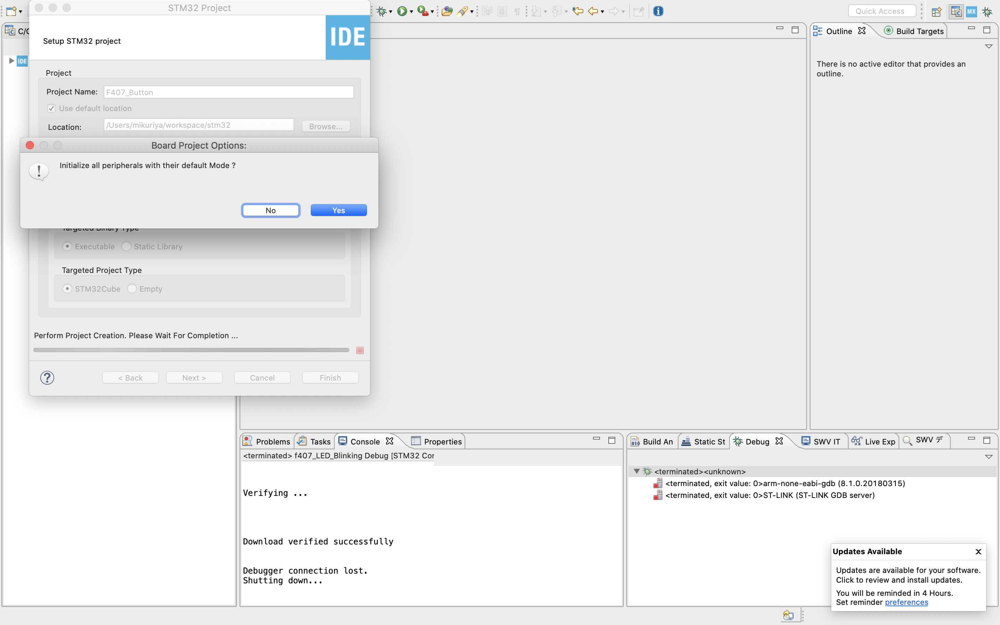

マイコンのピンアサイン画面が開きます。

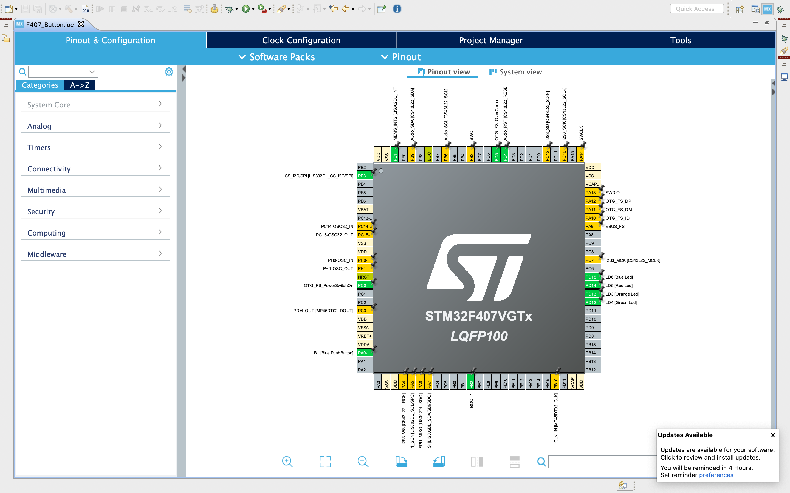

左蘭の [System Core] → [RCC] を選択します。
High Speed Clock (HSE) を Crystal/Ceramic Resonator にします。
F4Discoveryには 8MHz のオシレーターが付いているので、これを使うための設定です。

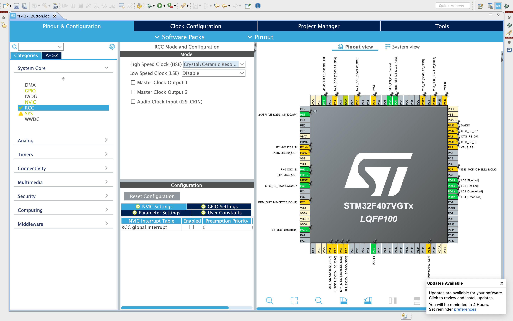

上タブの Clock Configuration を選択します。

本マイコンは 最大168MHz で動作します。
また前述したとおり 8MHz のオシレーターが付いていますので、これを入力として逓倍と分周をして 168MHz を作り出すように設定します。

以下画像のように設定してください。

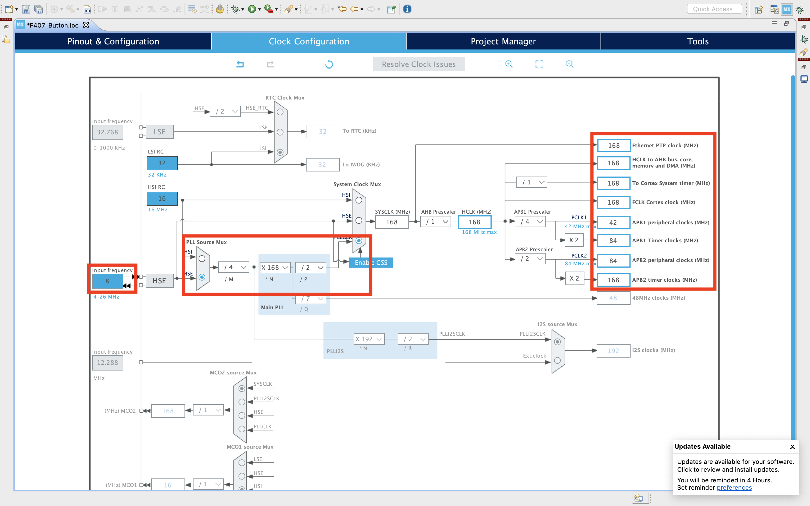

上タブの Project Maneger を選択します。
次に左タブの Advanced Settings を選択します。

GPIO、RCC がデフォルトだと HAL となっていますが、 本記事は LL の使い方解説なので LL を選択します。

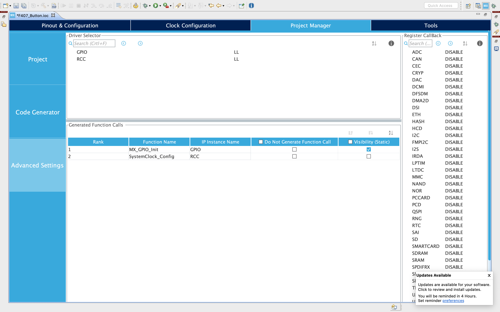

以上が設定できたら、 ioc ファイルを保存してください。
保存すると自動的に C言語のファイル等必要なものが生成されます。

以上でコーディング前の準備は完了です。

## コーディング

Core/Src/main.c を開き main関数 に以下を追記してください。

```main.c
/* Infinite loop */
/* USER CODE BEGIN WHILE */
while (1)
{
  /* USER CODE END WHILE */
  // 【追記開始】
  if(LL_GPIO_IsInputPinSet(B1_GPIO_Port, B1_Pin))
  {
    LL_GPIO_SetOutputPin(LD3_GPIO_Port, LD3_Pin);
    LL_GPIO_SetOutputPin(LD4_GPIO_Port, LD4_Pin);
    LL_GPIO_SetOutputPin(LD5_GPIO_Port, LD5_Pin);
    LL_GPIO_SetOutputPin(LD6_GPIO_Port, LD6_Pin);
  } else {
    LL_GPIO_ResetOutputPin(LD3_GPIO_Port, LD3_Pin);
    LL_GPIO_ResetOutputPin(LD4_GPIO_Port, LD4_Pin);
    LL_GPIO_ResetOutputPin(LD5_GPIO_Port, LD5_Pin);
    LL_GPIO_ResetOutputPin(LD6_GPIO_Port, LD6_Pin);
  }
  // 【追記終了】
  /* USER CODE BEGIN 3 */
}
```

以上でコーディングは完了です。

## 実行する

STM32F4Discovery を USBケーブル で PC に繋いでください。

メニューバーから [Run] → [Debug] を選択します。

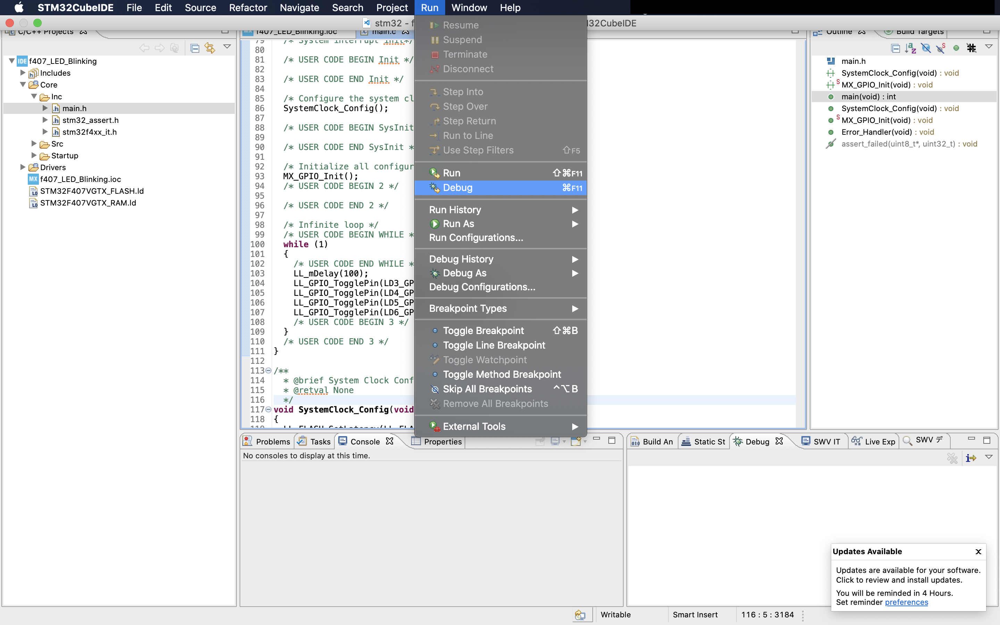

右下の OK を押します。

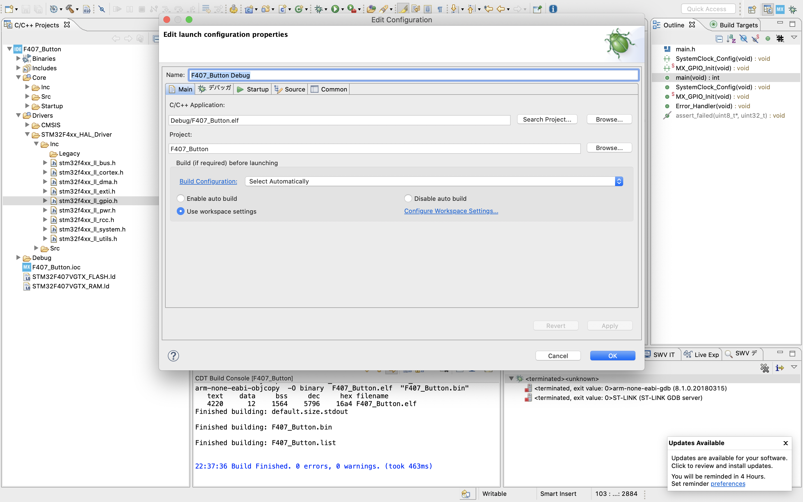

STM32F4Discovery に搭載されている ST-Link（JTAG）のバージョンが古いと以下画面が出るので最新にアップデートしてください。
アップデート完了したら上記手順に戻り再度実行します。

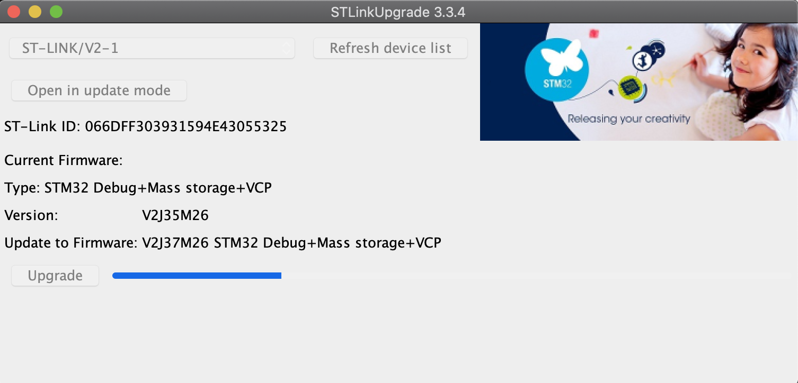

main関数の先頭で止まるので、左上の三角ボタンを押して続きを実行してください。
（一行ずつのステップ実行なども可能です）

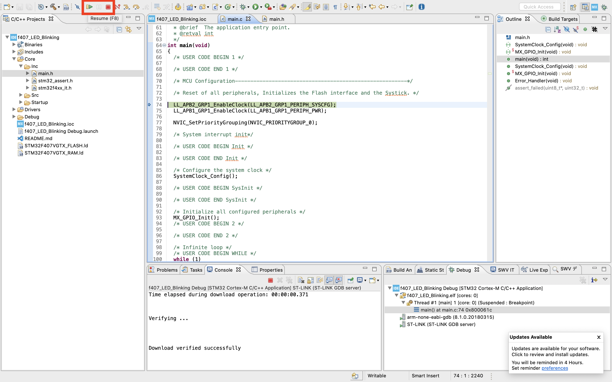

青いボタンを押すとLEDが光り、離すと消えるようになりました。

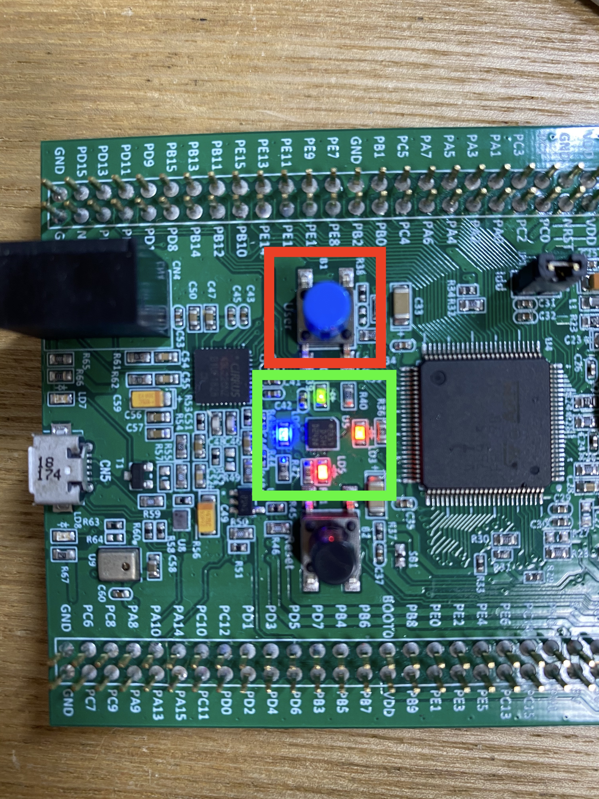

以上で実行完了です。

# 【第二弾】 ボタン入力を割り込みで検出する

## コーディング前の準備

F407_Button.ioc を開きます。

Pinout view の左下あたりにある PA0-WKUP をクリックし、 GPIO_EXTI0 を選択します。

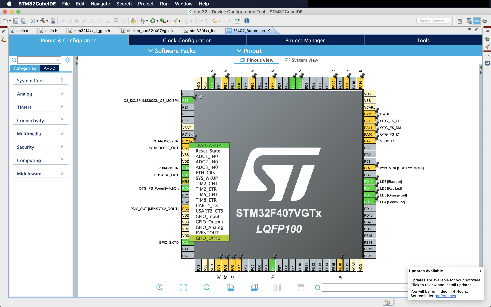

[System Core] → [NVIC] → [EXTI line0 interrupt] の Enabled にチェックを入れます。
これにより、ボタンを押した際に割り込み関数が呼ばれるようになります。

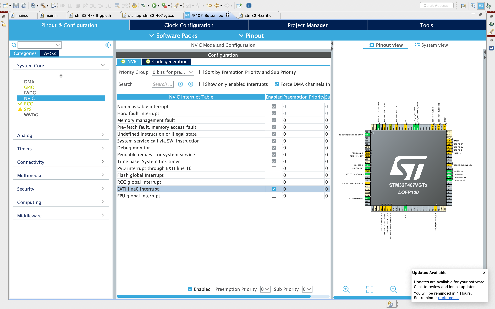

[System Core] → [GPIO] → [PA0-WKUP] を選択し、
GPIO mode で External Interrupt Mode with Rising/Falling trigger detection を選択します。
これにより、ボタン押したとき／離したときの両方で割り込みが発生するようになります。

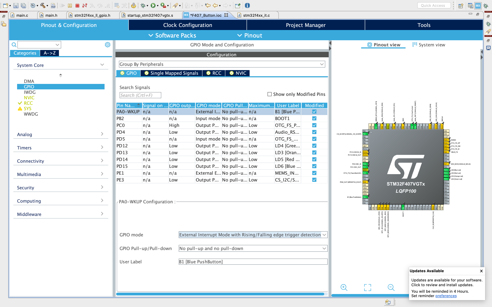

ここまで設定したら F407_Button.ioc を保存して、ソースコードを自動生成します。

## コーディング

ポーリングのときに書き換えた main関数のコードを削除します。

```main.c
/* Infinite loop */
/* USER CODE BEGIN WHILE */
while (1)
{
  /* USER CODE END WHILE */
  /* USER CODE BEGIN 3 */
}
```

割り込み関数を実装するファイル stm32f4xx_it.c を開き以下のように書き換えます。

```stm32f4xx_it.c
void EXTI0_IRQHandler(void)
{
  /* USER CODE BEGIN EXTI0_IRQn 0 */

  /* USER CODE END EXTI0_IRQn 0 */
  if (LL_EXTI_IsActiveFlag_0_31(LL_EXTI_LINE_0) != RESET)
  {
    LL_EXTI_ClearFlag_0_31(LL_EXTI_LINE_0);
    /* USER CODE BEGIN LL_EXTI_LINE_0 */
    // 【追記開始】
    if(LL_GPIO_IsInputPinSet(B1_GPIO_Port, B1_Pin))
    {
      LL_GPIO_SetOutputPin(LD3_GPIO_Port, LD3_Pin);
      LL_GPIO_SetOutputPin(LD4_GPIO_Port, LD4_Pin);
      LL_GPIO_SetOutputPin(LD5_GPIO_Port, LD5_Pin);
      LL_GPIO_SetOutputPin(LD6_GPIO_Port, LD6_Pin);
    } else {
      LL_GPIO_ResetOutputPin(LD3_GPIO_Port, LD3_Pin);
      LL_GPIO_ResetOutputPin(LD4_GPIO_Port, LD4_Pin);
      LL_GPIO_ResetOutputPin(LD5_GPIO_Port, LD5_Pin);
      LL_GPIO_ResetOutputPin(LD6_GPIO_Port, LD6_Pin);
    }
    // 【追記終了】
    /* USER CODE END LL_EXTI_LINE_0 */
  }
  /* USER CODE BEGIN EXTI0_IRQn 1 */

  /* USER CODE END EXTI0_IRQn 1 */
}
```

以上で実装は完了です。

## 実行する

ポーリングのときと同じように実行してください。
ボタン押したらLEDが光り、離したらLEDが消えるはずです。

# ソースコード一式

https://github.com/hiroshi-mikuriya/F407_Button

# 参考

STマイクロエレクトロニクスのサンプルコード、および STM32CubeIDE が自動生成するコードを元に本記事を作成しています。